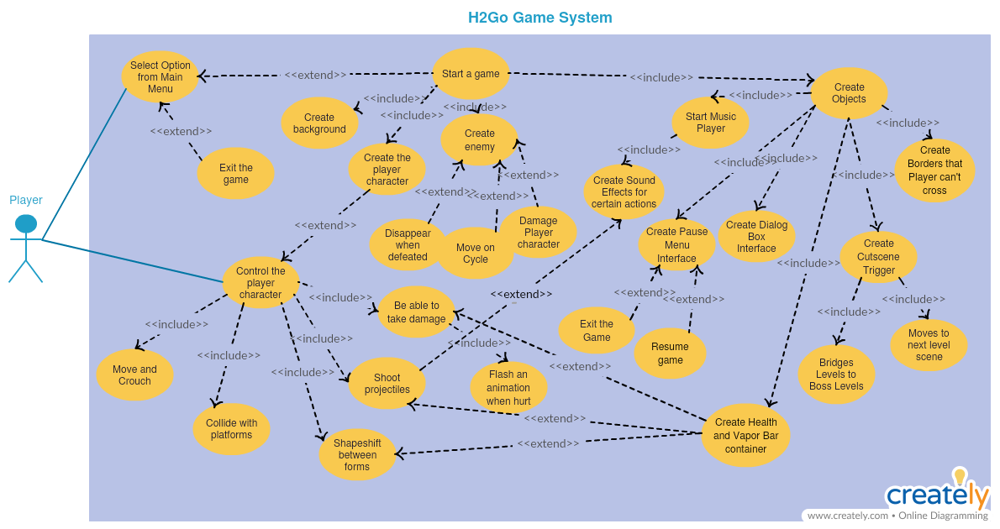
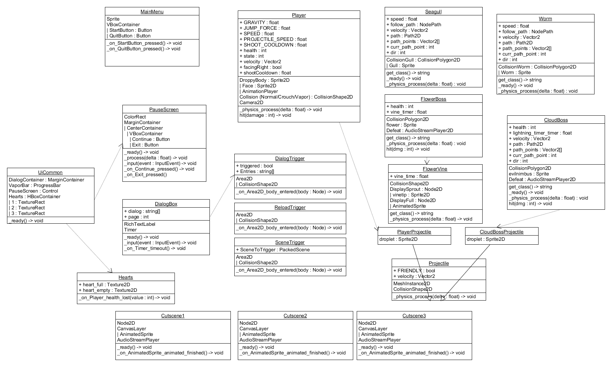

# Software Requirements and Design Document For Group <X>
Version 3.0
# Authors
Chase Warrington <!-- spacechase0 -->

Amanda Lovett <!-- arin -->

Megan Primavera <!-- Danger Duchess -->

Carissa Garde <!-- HollenStarr -->

# Overview
<!-- 5 points -->
<!-- Give a general overview of the system in 1-2 paragraphs (similar to the one in the project proposal). -->

# Functional Requirements
<!-- 10 points -->
1) Movement of player character (aka Droppy). This includes walking, jumping, crouching, and flying. (Priority: High)
2) Accurate collision of characters with platforms and other characters (Priority: High)
3) Ability to shoot projectiles (beads of water). (Priority: Medium-High)
4) Implementation of enemy characters. (Priority: Medium-High)
5) Implementation of boss characters. (Priority: Medium-High)
6) Implementation of cutscenes that, upon finishing, lead to other scenes in the game (Priority: Medium-High)
7) Implementation of triggers, either on levels or on boss defeat that lead to cutscenes (Priority: Medium)
8) Interactivity with characters that prompt text boxes (Priority: Medium)
9) Implementation of game boundaries that prevent the player from going out of bounds (Priority: Medium-Low)

~~10. Saving current progress of the player through the game (Priority: Medium-Low)~~ No longer included in implementation. Game in its 
entirety can be completed in ~10 minutes, therefore saving the game is redundant.

11) Implementing hurt animations when hit(Priority: Low)
12) Implementation of a main menu and pause menu. (Priority: Low)
<!-- List the functional requirements in sentences identified by numbers and for each requirement state if it is of high, medium, or low priority. Each functional requirement is something that the system shall do. Include all the details required such that there can be no misinterpretations of the requirements when read. Be very specific about what the system needs to do (not how, just what). You may provide a brief design rationale for any requirement which you feel requires explanation for how and/or why the requirement was derived. -->

# Non-functional Requirements
<!-- 10 points -->
1) Story: Gives the player a scenario to follow along, provides context for the adventures the main character goes on.
2) Art: A variety of different digital drawings that add to the visual appeal of the game.
   (Subset: Animation - add more "life" and variety to the game by creating moving pictures)
3) Music: Audio to keep the player engaged. Different audio pieces will match for different scenes throughout the game.  
<!-- List the non-functional requirements of the system (any requirement referring to a property of the system, such as security, safety, software quality, performance, reliability, etc.) You may provide a brief rationale for any requirement which you feel requires explanation as to how and/or why the requirement was derived. -->

# Use Case Diagram
<!-- 10 points -->
 
The use cases go as follows: The player opens the game to a start menu that allows the user to either quit or start the game. On starting a game, it should create a background, the player character, enemy, objects. Objects include: A music player which loops the game's theme, a pause menu interface which is only available upon hitting escape, a dialog box interface which will trigger when the player hits a certain point, a cutscene trigger which is triggered at the end of the level, a health and vapor bar container, and creates borders that the player can't cross to prevent asset loss or glitches. The cutscene trigger should allow for the player to move to the next level scene or bridge to a boss level, depending on the placement. The vapor bar and health bar are connected to signals from shapeshift, projectiles, and damage. The music player should also create sound effects for different actions more specifically when the player shoots projectiles. The Pause menu interface includes two buttons and a screen: the buttons will exit the Game and resume game depending on which is clicked (Exit and Continue respectively). The enemy will be created and moved on a designated walk cycle and disappear when hit by a projectile (defeat). The enemy must also be able to be hit by the player character. The player character then needs to be able to be controlled by the player. The character should be able to move and crouch using the WASD keys, collide with platforms when they move to them, shapeshift between forms using "Space", shoot projectiles using "f", and be able to take damage when colliding with the enemy. The player sprite should also be able to play an animation when hurt.
<!-- This section presents the use case diagram and the textual descriptions of the use cases for the system under development. The use case diagram should contain all the use cases and relationships between them needed to describe the functionality to be developed. If you discover new use cases between two increments, update the diagram for your future increments.  -->
<!-- Textual descriptions of use cases: For the first increment, the textual descriptions for the use cases are not required. However, the textual descriptions for all use cases discovered for your system are required for the second and third iterations. -->

# Class Diagram and/or Sequence Diagrams
<!-- 15 points -->

<!-- This section presents a high-level overview of the anticipated system architecture using a class diagram and/or sequence diagrams. -->
<!-- If the main paradigm used in your project is Object Oriented (i.e., you have classes or something that acts similar to classes in your system), then draw the Class Diagram of the entire system and Sequence Diagrams for the three (3) most important use cases in your system. -->
<!-- If the main paradigm in your system is not Object Oriented (i.e., you do not have classes or anything similar to classes in your system) then only draw Sequence Diagrams, but for all the use cases of your system. In this case, we will use a modified version of Sequence Diagrams, where instead of objects, the lifelines will represent the functions in the system involved in the action sequence. -->
<!-- Class Diagrams show the fundamental objects/classes that must be modeled with the system to satisfy its requirements and the relationships between them. Each class rectangle on the diagram must also include the attributes and the methods of the class (they can be refined between increments).  All the relationships between classes and their multiplicity must be shown on the class diagram. -->
<!-- A Sequence Diagram simply depicts interaction between objects (or functions - in our case - for non-OOP systems) in a sequential order, i.e. the order in which these interactions take place. Sequence diagrams describe how and in what order the objects in a system function. -->

# Operating Environment
<!-- 5 points -->
The environment the software will operate in is any desktop environment(Windows, Linux, Mac). The primary version of the release is for Windows. 
<!-- Describe the environment in which the software will operate, including the hardware platform, operating system and versions, and any other software components or applications with which it must peacefully coexist. -->

# Assumptions and Dependencies
<!-- 5 points -->
There are no dependencies or assumptions to be made for this project, save for use of the engine itself should any versions of the release not work correctly on their own accord. The releases should be fully functional/independent, but if there are any issues running the game in its executable/compressed form, it should operate correctly within the engine itself. 
<!-- List any assumed factors (as opposed to known facts) that could affect the requirements stated in this document. These could include third-party or commercial components that you plan to use, issues around the development or operating environment, or constraints. The project could be affected if these assumptions are incorrect, are not shared, or change. Also identify any dependencies the project has on external factors, such as software components that you intend to reuse from another project. -->
